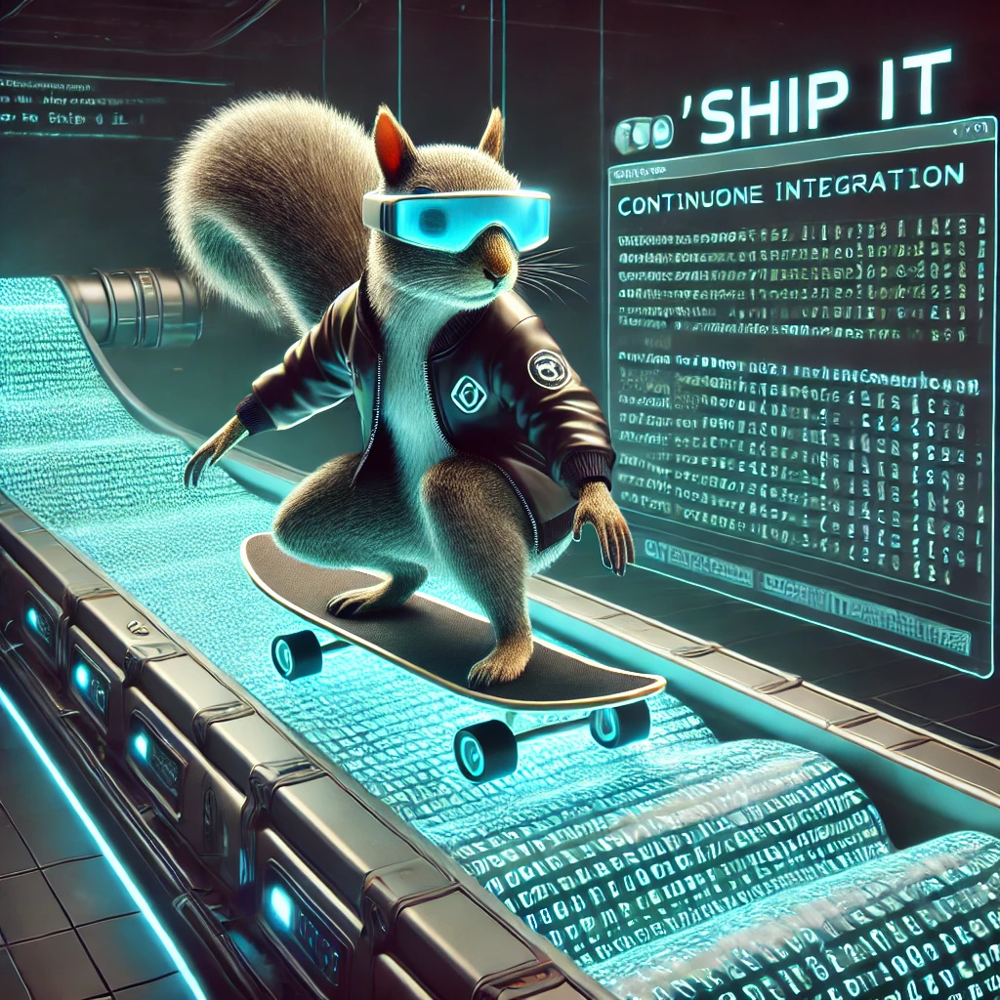
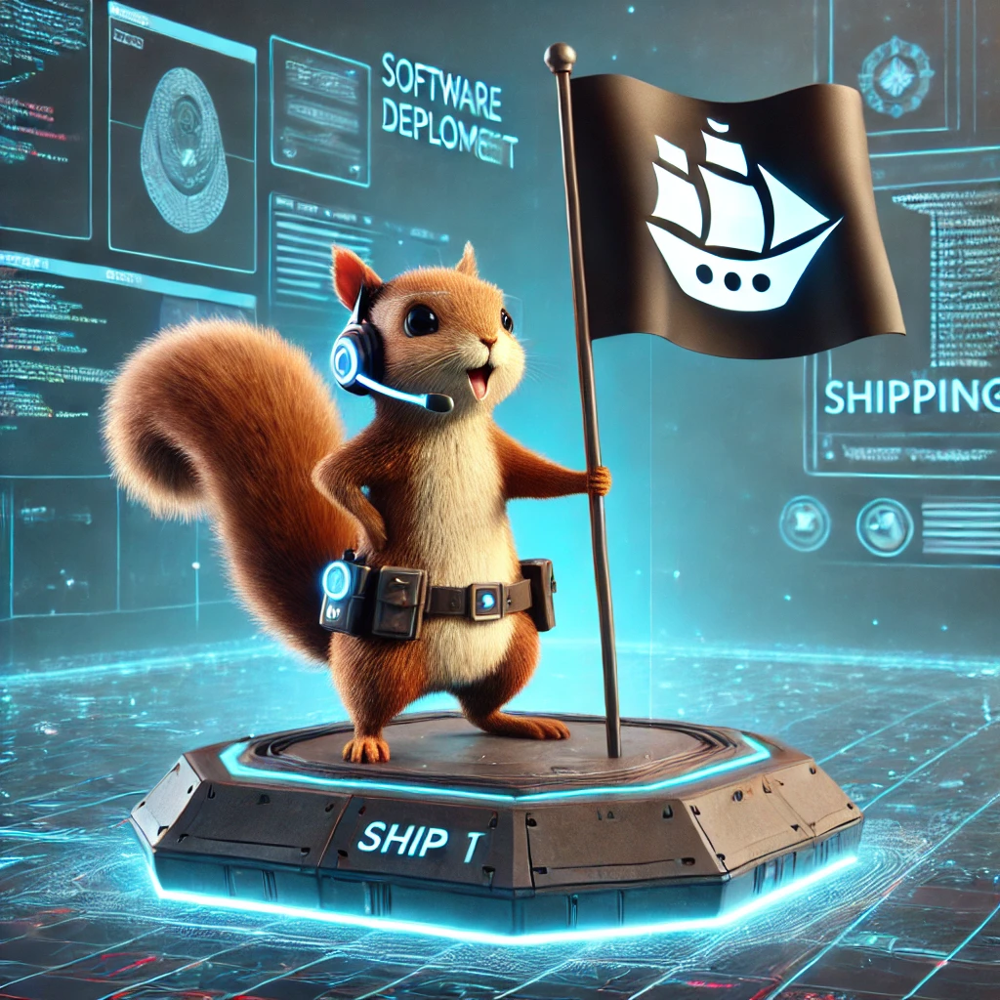

# Ship It Squirrels :shipit:

Inspired from the GitHub Developers' original Hubot shipit squirrels, these are futuristic shipit squirrels for developers! These squirrels are AI-generated, credits go to OpenAI's DALLE-3 model. Check them out below! 😄

For further context see [What is the significance of the GitHub Ship It Squirrel?](https://www.quora.com/On-GitHub-what-is-the-significance-of-the-Ship-It-squirrel). Some of the original Hubot squirrels are in this [commit](https://github.com/github/hubot-scripts/commit/247310f83e8f0a33230c4a2ceb5e68ca86006e18).

## 🖼️ Squirrel Gallery

  
  
  
  
  
  
  
  
  
  
  
  
  
  
  
  
  
  
  
  
  
  
  
  
  
  
  
  
  
  

## 🛠️ Usage

This section assumes you're using this in Slack. If you're using some other messaging platform, you should be able to set something up via a custom bot. 

To use this with Slack, you can follow the guide at https://slack.com/resources/using-slack/a-guide-to-slackbot-custom-responses on how to set up custom responses. Specifically, you'll want to set up the following:
1. The appropriate triggers e.g. `"ship it", "shipit", "ship_it_parrot", "ship all the things"`
2. The potential responses, each separated by newline - these should be the links to the ship it squirrel images 

Note that Slack only unfurls images properly if you use the _raw_ links i.e. use https://raw.githubusercontent.com/Advait-M/shipit-squirrels/main/squirrels/shipit-airplane-squirrel.png not https://github.com/Advait-M/shipit-squirrels/blob/main/squirrels/shipit-airplane-squirrel.png!

Use these squirrels to **ship it** in style! 🚢 :shipit:

---

Enjoy the squirrels! 🎉
